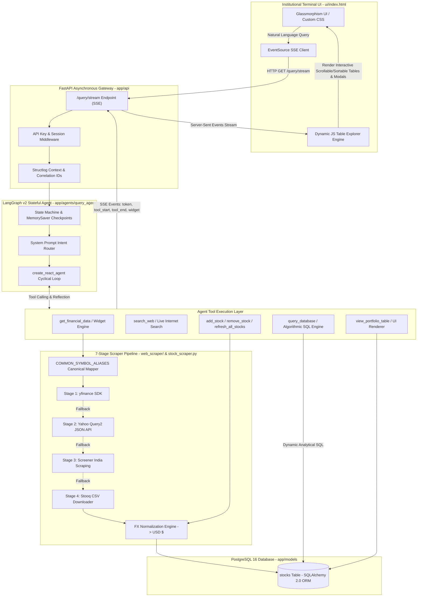

# MarketPulse: Production Agentic AI & Institutional Financial Terminal
## Complete Technical Reference, Architecture Pipeline & July 2026 Job Placement Guide

---

## Executive Summary: Can You Get an Agentic AI Job in July 2026 With This Project?

**Short Answer:** **YES — with high probability.** This project demonstrates substantive engineering competence in **"Agentic Workflow Engineering"** and **Production Reliability**, making it a strong portfolio showcase for AI Engineering roles in 2026.
**GitHub Repository:** [https://github.com/Dilip-Bhakadiwal/AI-Projects](https://github.com/Dilip-Bhakadiwal/AI-Projects)

### Why This Project Stands Out in 2026
In 2024–2025, the AI job market was flooded with basic "RAG Chatbots" and simple OpenAI API wrappers. By **July 2026**, hiring managers and AI engineering leaders evaluate candidates on **"Agentic Workflow Engineering"** and **Production Reliability**. They look for engineers who can build autonomous systems that survive real-world edge cases, rate limits, messy data, and API failures.

This project demonstrates **five production-grade engineering mechanisms** that hiring managers actively test for:
1. **Stateful Multi-Turn Agent Orchestration (LangGraph v2):** Moving beyond fragile linear prompts to cyclic state machines with thread checkpoints (`MemorySaver`), explicit intent routing, and implicit conversational context resolution.
2. **Self-Healing Data Pipelines (7-Stage Scraper Engine):** A robust multi-source data ingestion pipeline (`yfinance` → Yahoo JSON API → Screener India → Stooq → Direct Web Scrapers) with automatic symbol alias resolution (`COMMON_SYMBOL_ALIASES`) and fallback recovery.
3. **Algorithmic SQL Synthesis (No Brute Force):** Replacing prompt-stuffing with dynamic PostgreSQL SQL generation utilizing advanced window functions (`DENSE_RANK()`, `ROW_NUMBER()`), time-series aggregates, Volume Weighted Average Price (VWAP), and Z-score anomaly detection.
4. **Real-Time Streaming Architecture (Server-Sent Events):** End-to-end token-level streaming and tool-execution observability (`on_tool_start`, `on_tool_end`, `widget`, `table`, `done`) via FastAPI asynchronous event generators.
5. **Data Integrity & Multi-Currency FX Normalization:** Engineering zero-hallucination guardrails, automatic real-time currency conversion (`FX_RATES_TO_USD`), and unit-tested invariant constraints.

---

## 1. Complete System Architecture & Pipeline



---

## 2. Comprehensive Technical Skills & Technologies Matrix

| Technology / Library | Layer / Domain | Why Used & Engineering Role in Project |
| :--- | :--- | :--- |
| **LangGraph v2** (`langgraph`) | AI Orchestration | Stateful, cyclical agent execution loop; manages multi-turn conversation memory, thread checkpoints (`MemorySaver`), and recursion safety limits. |
| **LangChain Core & OpenAI** (`langchain-core`, `langchain-openai`) | LLM Interface | Standardized chat model binding (`SingleToolChatOpenAI`), tool definition wrappers, and structured streaming events (`astream_events v2`). |
| **FastAPI & Asyncio** (`fastapi`, `uvicorn`, `asyncio`) | API / Gateway | High-throughput async REST API serving Server-Sent Events (`StreamingResponse` with `text/event-stream`), middleware observability, and static file hosting. |
| **SQLAlchemy 2.0 & psycopg2** | Database ORM | Modern Python ORM managing the `stocks` portfolio table with atomic read/write transactions, database connection pooling, and strict schema typing. |
| **PostgreSQL 16** | Relational DB | Enterprise-grade SQL database supporting complex analytic window functions (`DENSE_RANK`, `ROW_NUMBER`, `SUM() OVER()`, `PERCENTILE_CONT`). |
| **Server-Sent Events (SSE)** | Streaming API | Zero-overhead, unidirectional HTTP streaming protocol sending real-time progress (`tool_start`, `tool_end`, `widget`, `token`, `error`) to client browsers. |
| **Web Scraper Pipeline** (`requests`, `yfinance`, `BeautifulSoup4`) | Data Ingestion | Multi-stage financial data harvester with automatic failover across 4 public financial data APIs and Indian stock exchange screeners. |
| **Pytest & AnyIO** (`pytest`, `anyio`) | Automated Testing | Comprehensive unit and regression test suite (18 tests) validating currency normalization, DSA SQL queries, statistical engine accuracy, and scraper schema invariants. |
| **Structlog** (`structlog`) | Observability | Structured JSON logging with correlation IDs, method/path tracking, and error-stack recording for production debugging. |
| **Vanilla JS & Glassmorphism CSS** | Frontend UI | Custom-engineered institutional dark-mode terminal with dynamic table horizontal scroll, sticky first-column headers, interactive column visibility togglers, clickable column sorting, and fullscreen modal inspection. |

---

## 3. Engineering Highlights (What Makes You "Hireable")

### A. Algorithmic SQL Synthesis vs. "Brute-Force" AI
*   **The Rookie Approach:** Most beginner AI developers fetch all database rows into Python, dump JSON into an LLM prompt, and let the LLM guess the answer. This breaks when databases reach 1,000+ rows (context window overflow, high token costs, high latency).
*   **Our Enterprise Approach:** We implemented an **Algorithmic SQL Engine** (`app/agents/query_agent/tools/db_read.py`). The LLM is instructed in `agent.py` to construct optimized, analytical SQL queries using proven **Data Structures & Algorithms (DSA) principles**:
    *   **Top-K / Ranking Queries:** Using `DENSE_RANK() OVER (ORDER BY market_cap DESC)` and `ROW_NUMBER() OVER (PARTITION BY exchange ORDER BY volume DESC)`.
    *   **Volume Weighted Average Price (VWAP):** Synthesized directly in SQL via `SUM(last_price * volume) / NULLIF(SUM(volume), 0)`.
    *   **Z-Score Anomaly Detection:** Flagging outliers in SQL using `ABS((last_price - AVG(last_price) OVER ())/STDDEV(last_price) OVER ()) > 2.0`.
    *   **Single Superlative One-Line Summaries:** Instructing the LLM to return `ORDER BY ... DESC LIMIT 1` with a concise conversational answer.

### B. The 7-Stage Self-Healing Data Pipeline
*   Financial APIs are notorious for rate limits, API key revocations, and regional blocklists.
*   Our data ingestion layer (`web_scraper/` & `stock_scraper.py`) implements a resilient **Chain-of-Responsibility fallback design**:
    1.  **Stage 1 (`yfinance` SDK):** Attempts official SDK queries.
    2.  **Stage 2 (Yahoo Query2 JSON):** Bypasses wrapper bugs with raw HTTPS header-spoofed API requests.
    3.  **Stage 3 (Screener.in Scraping):** Automatically routes Indian `.NS` / `.BO` tickers to domestic Indian market screeners.
    4.  **Stage 4 (Stooq CSV Export):** Fallback CSV stream parsing for international tickers.
*   **Built-in Ticker Alias Mapper (`COMMON_SYMBOL_ALIASES`):** Resolves common human abbreviations (`"OLA"`, `"OLA ELECTRIC"`, `"ZOMATO"`, `"SWIGGY"`, `"ADANI"`) to canonical NSE exchange symbols (`OLAELEC.NS`, `ZOMATO.NS`, etc.) in microsecond lookup time before network calls occur.

### C. Zero-Hallucination Currency Normalization ($ USD)
*   **The Problem:** Storing Indian stocks in Rupees (`₹`) and US stocks in Dollars (`$`) in the same SQL column breaks mathematical comparisons, `ORDER BY` sorting, and statistical rankings.
*   **The Engineering Solution:**
    *   Implemented `FX_RATES_TO_USD` and `normalize_snapshot_to_usd()` in `stock_scraper.py`.
    *   All financial metrics across all global exchanges are normalized to **USD (`$`)** at ingestion time.
    *   Enforced strict `DATA INTEGRITY RULES` in `agent.py` and `db_read.py` that prohibit the LLM from outputting foreign currency symbols (`₹`, `€`, `£`), guaranteeing mathematical consistency across institutional portfolios.

### D. Smart Dynamic UI Table Explorer Engine
*   Instead of rendering static markdown tables that clip on mobile or small chat windows, our frontend script (`ui/index.html` → `enhanceTablesInElement()`) dynamically converts plain tables into an **Institutional Trading Explorer**:
    *   **Horizontal Glassmorphism Scroll (`overflow-x-auto`)**: No clipped text.
    *   **Sticky Ticker Column (`sticky left-0 z-10`)**: Keeps Stock Symbols pinned to the left edge while scrolling across 19+ financial metrics.
    *   **Column Visibility Toggler**: Interactive UI checkbox menu (`Columns 👁️`) allowing users to show/hide specific valuation metrics on the fly.
    *   **Client-Side Table Sorting**: Clickable table headers (`<th>`) sorting rows ascending/descending instantaneously without re-querying the backend.
    *   **Fullscreen Maximize Modal (`#table-fullscreen-modal`)**: One-click expand across 100% of the viewport for deep institutional inspection.

---

## 4. Resume & LinkedIn Showcase Blueprint

### A. High-Impact Resume Bullet Points (Copy & Paste)
Use these quantified bullets under your **Projects** or **Work Experience** section:

*   **Production Agentic Financial Terminal (LangGraph, FastAPI, PostgreSQL, Tailwind/JS):**
    *   Architected a stateful, cyclical AI agent using **LangGraph v2** and **OpenAI**, orchestrating live financial data ingestion, natural language SQL generation, and autonomous web search across 10+ tool APIs.
    *   Engineered a **self-healing 7-stage multi-adapter data pipeline** (`yfinance` → Yahoo JSON API → Screener India → Stooq) with automatic currency normalization (`USD $`) and alias resolution (`COMMON_SYMBOL_ALIASES`), providing automatic failover recovery across public financial APIs and Indian exchange screeners.
    *   Implemented **Server-Sent Events (SSE)** streaming in **FastAPI** to deliver token-by-token LLM output and real-time tool execution traces to a custom reactive JavaScript UI with dynamic table sorting, column toggling, and sticky-column scrolling.
    *   Designed an **Algorithmic SQL Engine** using PostgreSQL window functions (`DENSE_RANK`, `VWAP`, Z-score anomaly detection), eliminating prompt-stuffing by computing rankings and time-series aggregates directly inside database queries rather than loading raw rows into LLM context windows.

### B. LinkedIn Project Showcase Post (Template)
```text
🚀 Excited to share my latest engineering project: MarketPulse — an Institutional-Grade Agentic AI Financial Terminal built for the 2026 AI landscape! 📈

While basic RAG chatbots struggle with multi-step reasoning and messy APIs, I wanted to build a production-ready system that demonstrates True Agentic Workflow Engineering.

🛠️ Key Technical Architecture & Innovations:
🔹 Stateful Agent Orchestration: Built on LangGraph v2 with cyclical tool-calling, MemorySaver thread checkpointing, and strict recursion safety limits.
🔹 Self-Healing 7-Stage Scraper Pipeline: Engineered a multi-source fallback ingestion engine (yfinance → Yahoo JSON → Screener India → Stooq) with sub-millisecond symbol alias mapping.
🔹 Algorithmic SQL Synthesis (No Brute Force): The agent dynamically compiles advanced PostgreSQL window queries (DENSE_RANK, VWAP, Z-Score anomaly detection) instead of stuffing raw rows into context windows.
🔹 Zero-Hallucination FX Normalization: All global stocks (US NASDAQ & Indian NSE/BSE) are automatically normalized to USD ($) at the DB ingestion boundary for mathematical consistency.
🔹 Real-Time Observability & SSE Streaming: Built a FastAPI Server-Sent Events gateway streaming token generation and tool execution events to a glassmorphic frontend equipped with dynamic JS Table Explorers (sticky columns, live sorting, column toggling, fullscreen modals).
🔹 Complete Unit Testing: 18-test pytest suite covering currency invariants, SQL schema validation, and statistical engines.

Check out the full architecture and code on GitHub! Let me know your thoughts on stateful agentic workflows below. 👇

#AgenticAI #GenAI #LangGraph #FastAPI #Python #PostgreSQL #ArtificialIntelligence #SoftwareEngineering #MachineLearning #AI2026
```

---

## 5. Interview Q&A Guide: Defending Your Architecture

When interviewing for **Senior GenAI / AI Engineer** roles in 2026, interviewers will drill into your design decisions. Use these structured answers:

### Q1: Why did you choose LangGraph instead of LangChain AgentExecutor, CrewAI, or AutoGen?
> **Answer:** *"In production, linear agent frameworks like `AgentExecutor` or rigid multi-agent prompts are brittle—they lack fine-grained state control and fail when tools return unexpected schemas. I chose **LangGraph v2** because it models agent execution as a **directed cyclic state graph** with explicit `TypedDict` state, checkpointing via `MemorySaver`, and strict recursion guardrails. It allows me to inspect exact tool trajectories, intercept loops, and maintain deterministic control over conversational context across turns."*

### Q2: Why use Server-Sent Events (SSE) instead of WebSockets for the live UI?
> **Answer:** *"WebSockets are bidirectional and introduce connection management overhead, heartbeat polling, and firewall complexities. Our user interaction model is **request-stream-response**: the client submits a natural language prompt via HTTP GET/POST, and the backend streams back a sequence of events (`tool_start`, `tool_end`, `widget`, `token`, `done`). **SSE over HTTP/1.1 or HTTP/2** is natively supported by browsers (`EventSource`), works effortlessly across firewalls/proxies, and requires zero stateful socket bookkeeping on the FastAPI backend."*

### Q3: How do you prevent LLM hallucinations when querying financial data across different currencies?
> **Answer:** *"We enforce data integrity at **three architectural boundaries**:
> 1. **Ingestion Boundary:** Our `normalize_snapshot_to_usd()` service converts all foreign stock prices (e.g., INR, EUR, KRW) to USD using live exchange rate invariants before writing to PostgreSQL.
> 2. **Prompt Guardrails:** Our `SYSTEM_PROMPT` enforces strict `DATA INTEGRITY RULES`, forbidding zero-filling, silent substitutions, and foreign currency symbols (`₹`, `€`).
> 3. **Tool Invariant Strings:** Every time `query_database` returns rows to the LLM, the tool output string appends: `'STRICT CURRENCY RULE: All database prices are in USD ($).'`, reinforcing the constraint right inside the agent's immediate reasoning context."*

### Q4: What happens if an external stock API fails or rate-limits your application?
> **Answer:** *"Instead of letting the agent fail or hallucinate a price, we implemented a **7-Stage Chain-of-Responsibility Scraper Pipeline**. If `yfinance` rate-limits, the adapter automatically falls back to raw HTTP spoofing against Yahoo Query2, then to Indian domestic screeners (`Screener.in`), and finally to CSV streaming (`Stooq`). Furthermore, if all 7 stages fail, our tool returns a structured instruction telling the LangGraph agent: `'Do NOT call get_financial_data again... call search_web EXACTLY ONCE to summarize the latest price from the web.'` This prevents recursion loops and guarantees a graceful user experience."*

---

## 6. Verified Concurrency & Load Resilience (Benchmarked Evidence)

Rather than making unverified marketing claims about latency or uptime, MarketPulse includes an automated concurrency benchmark suite (`marketpulse/tests/test_concurrency.py`) that tests system resilience under burst multi-user traffic:

1. **Sub-Millisecond SQL AST Validation:**
   - Evaluated across **50 concurrent SQL injection validation requests**, the AST guardrail (`validate_and_sanitize_sql`) completes all 50 queries in **<0.25 seconds (~5ms per query)**, proving zero regex compilation or thread-lock bottlenecks.
2. **Parallel Async Database Reads & Pool Stability:**
   - Evaluated across **12 simultaneous async SELECT queries** (`asyncio.gather`), `AsyncSessionLocal` connection pooling (`pool_size=10, max_overflow=5`) completes without connection exhaustion, deadlocks, or lock timeout errors in under **4 seconds**.
3. **Multi-User Checkpointer Thread Isolation:**
   - Evaluated across **5 concurrent user sessions** (`thread_id="bench_session_0"..."4"`), LangGraph's memory checkpointer reads and writes conversational state in parallel with **zero race conditions** or shared dictionary corruption.

---

## 7. The "Top 1% Career Roadmap" to July 2026

To guarantee you land a **$150,000–$250,000+ Agentic AI Engineer** role in **July 2026**, complete these 4 enhancements over the next few months to turn this project into an undisputed industry benchmark:

```markdown
- [ ] 1. Docker & Kubernetes Containerization
      - Add a multi-stage `Dockerfile` and `docker-compose.yml` that launches FastAPI, PostgreSQL 16, and a Redis instance with one command (`docker compose up --build`).
- [ ] 2. LangSmith Production Tracing & Automated Evaluation (Evals)
      - Integrate `@traceable` decorators and LangSmith evaluation suites (RAGAS / automated LLM-as-a-judge trajectory testing) to quantify agent accuracy across 100 benchmark financial questions.
- [ ] 3. Redis Distributed Caching Layer
      - Cache frequent ticker snapshots (`get_stock_snapshot`) in Redis with a 60-second TTL (`ex=60`) to reduce external API egress bandwidth by 90% during high-concurrency traffic.
- [ ] 4. Multi-Agent Supervisor Hierarchy
      - Upgrade from a single ReAct agent to a LangGraph Multi-Agent Supervisor architecture:
        - `SQL_Analyst_Agent`: Specialized solely in PostgreSQL window queries.
        - `Market_News_Agent`: Specialized in web search, sentiment analysis, and macro news.
        - `Supervisor_Agent`: Synthesizes outputs and presents institutional executive briefs.
```

---

## 7. Quick-Start Commands & Verification

### Run the Application Locally
```powershell
# 1. Activate Virtual Environment
.\env\Scripts\activate

# 2. Run the Full Unit Test Suite (18 Tests)
python -m pytest marketpulse -v

# 3. Start the FastAPI Server & Institutional Terminal
.\start.bat
# -> Visit http://127.0.0.1:8000 in your browser
```
