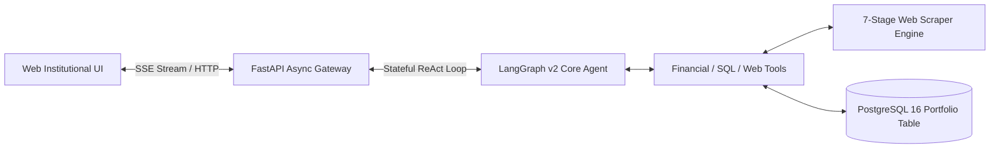

# MarketPulse AI: Institutional-Grade Agentic Financial Terminal
[](https://github.com/langchain-ai/langgraph)
[](https://fastapi.tiangolo.com)
[](https://www.postgresql.org)
[](https://www.python.org)
[](https://pytest.org)

**MarketPulse** is a production-grade conversational AI financial data analyst and institutional portfolio terminal built on **LangGraph v2**, **FastAPI**, **PostgreSQL**, and **Server-Sent Events (SSE)** streaming.

> **Looking for the Complete Architecture, Resume Blueprint, & Technical Deep-Dive?**  
> 👉 Read the comprehensive guide: **[`PROJECT_PORTFOLIO_GUIDE.md`](./PROJECT_PORTFOLIO_GUIDE.md)**

---

## 🌟 Key Engineering Capabilities

1. **Stateful Agentic Control Flow (LangGraph v2):**
   - Implements cyclical ReAct agent loops with persistent thread checkpoints (`MemorySaver`), explicit intent routing, and implicit conversational context resolution.
2. **Self-Healing 7-Stage Scraper Pipeline (`web_scraper`):**
   - Robust multi-source data ingestion (`yfinance` → Yahoo JSON API → Screener India → Stooq → Direct Web Scrapers) with automatic symbol alias resolution (`COMMON_SYMBOL_ALIASES`) and graceful error recovery.
3. **Algorithmic SQL Synthesis (No Brute Force):**
   - Synthesizes advanced PostgreSQL window queries (`DENSE_RANK()`, `ROW_NUMBER()`), Volume Weighted Average Price (`VWAP`), time-series aggregates, and Z-score anomaly detection directly in database SQL.
4. **Real-Time Streaming UI (Server-Sent Events):**
   - Token-level streaming and real-time tool execution traces (`tool_start`, `tool_end`, `widget`, `table`) via FastAPI asynchronous event generators.
5. **Dynamic UI Table Explorer Engine:**
   - Features horizontal glassmorphism scroll, sticky first-column Tickers, interactive column visibility togglers (`Columns 👁️`), client-side clickable column sorting, and fullscreen modal inspection.
6. **Zero-Hallucination FX Currency Normalization:**
   - Automatically converts all international stock prices (NSE India, LSE, Tokyo, NASDAQ) to **USD ($)** at the DB ingestion boundary for mathematical invariant consistency.

---

## 🚀 Quick Start & Installation

```powershell
# 1. Clone the repository and enter the directory
git clone https://github.com/Dilip-Bhakadiwal/AI-Projects.git
cd AI-Projects

# 2. Create and activate Python virtual environment
python -m venv env
.\env\Scripts\activate

# 3. Install dependencies
pip install -r requirements.txt

# 4. Run the 18-Test Pytest Suite
python -m pytest marketpulse -v

# 5. Launch the FastAPI Terminal & Web UI
.\start.bat
```

Open your browser to **http://127.0.0.1:8000** to interact with the Institutional Terminal.

---

## 🏗️ Architecture Overview



For detailed diagrams, sequence workflows, interview Q&A guides, and a skill matrix, check out **[`PROJECT_PORTFOLIO_GUIDE.md`](./PROJECT_PORTFOLIO_GUIDE.md)**.
